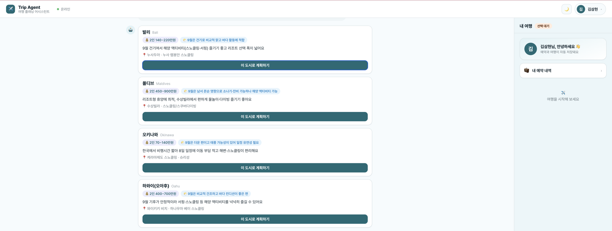
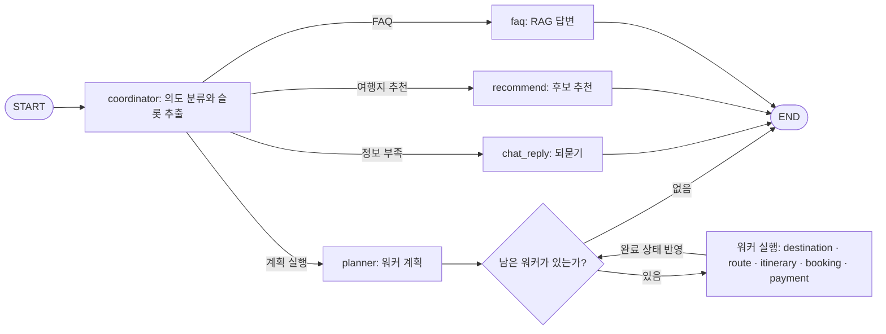

# Trip Agent

[](https://www.python.org/)
[](https://fastapi.tiangolo.com/)
[](https://langchain-ai.github.io/langgraph/)
[](https://www.langchain.com/)
[](https://react.dev/)
[](https://vitejs.dev/)
[](https://github.com/pgvector/pgvector)
[](https://www.sqlalchemy.org/)


**🎬 데모 영상 원본: [demo/trip-agent-demo-v2-fast.mp4](demo/trip-agent-demo-v2-fast.mp4)** (1분 17초, 1.8배속)

대화로 여행지를 좁히고 명소·항공·숙소를 검색한 뒤, 동선과 일정, 예약 내역 저장과
더미 결제까지 이어 주는 멀티턴 여행 에이전트입니다. LangGraph 기반 supervisor 구조로
구성했으며, 각 워커 에이전트가 검색 조건을 판단해 필요한 외부 API를 호출합니다.

> 이어드림스쿨 8주차 개인 프로젝트 (2026-07-16 ~ 2026-07-22)
>
> 실제 발권이나 결제는 하지 않는 학습·시연용 프로젝트입니다. 자세한 설계는
> [`docs/design.md`](docs/design.md)에서 확인할 수 있습니다.

## 주요 기능

- **대화가 이어지는 여행 계획**: “제주도 갈까 하는데”라고 말하면 기간과 인원을 되묻고, 명소·일정·항공·숙소·결제 순서로 대화를 이어 갑니다. 목적지·날짜·인원은 턴마다 누적하며 “제주 말고 부산” 같은 정정도 반영합니다.
- **검색 도구를 사용하는 워커 에이전트**: “저녁 비행기로 제일 싼 거”라는 요청에서 시간대와 정렬 조건을 판단합니다. 실제 필터링과 정렬은 코드가 맡습니다.
- **등록되지 않은 해외 도시 해석**: 제주·부산·세부·보홀 외의 도시도 영문명과 좌표를 조회해 런타임에 등록합니다. Geoapify 키는 도시 등록에, Duffel 키는 공항과 항공편 조회에 사용합니다.
- **항공과 숙소를 나누어 예약**: 항공권을 먼저 고른 뒤 다음 턴에서 숙소를 선택합니다. “제주시 2일, 서귀포 2일”처럼 지역을 나눈 숙박도 각각의 카드로 보여 줍니다.
- **화면 선택과 대화 연결**: 사용자가 카드에서 선택한 항공과 숙소를 다음 메시지에 함께 전달합니다. “이렇게 해서 예약하고 싶어” 같은 표현도 앞선 선택을 바탕으로 처리합니다.
- **여러 도시의 이동 순서 비교**: 두 도시를 여행할 때 방문 순서, 숙박 배분, 이동 수단, 출국 공항이 다른 A/B 안을 비교합니다.
- **실제 데이터를 담은 카드 UI**: 명소 사진, 왕복 항공편, 숙소 목록을 카드로 보여 줍니다. 가격·평점 정렬, 지역 필터, 호텔 상세 모달도 지원합니다.
- **텍스트와 카드의 하이브리드 스트리밍**: 대화와 일정은 토큰 단위로 보여 주고, 구조화된 카드는 데이터가 완성된 뒤 한 번에 전송합니다.
- **계정별 여행 내역 저장**: JWT 기반 회원가입과 로그인을 지원합니다. 여행·예약·결제 내역을 계정에 저장하고 다른 사용자의 데이터에는 접근할 수 없도록 소유권을 확인합니다.
- **출처가 있는 FAQ 답변 (RAG)**: 환불·수하물 같은 정책 질문은 FAQ 33건(`backend/app/data/faq.json`)을 pgvector 유사도 검색으로 찾아 **근거로만** 답하고 출처를 표기합니다. 거리 임계값을 넘는 근거가 없으면 지어내지 않고 "확인이 어려워요"라고 안내하며, 임베딩 API가 없으면 키워드 검색으로 전환합니다.  시연: [`demo/trip-agent-demo-faq.mp4`](demo/trip-agent-demo-faq.mp4) (25초)



## 데이터 사용 방식

외부 데이터 API 키는 선택 사항입니다. 키가 없거나 API 호출에 실패하면 저장소의 mock JSON을
사용합니다. 에이전트가 대화를 해석하고 계획을 세우려면 elice AI Cloud 또는 OpenAI API 키가
필요합니다.


| 설정                   | 동작                                     |
| -------------------- | -------------------------------------- |
| LLM 키 + 데이터 API 키    | 외부 API를 먼저 호출하고, 실패한 데이터만 mock으로 대체    |
| LLM 키만 설정            | 대화와 계획은 LLM이 처리하고 명소·항공·숙소는 mock 사용    |
| `USE_MOCK_ONLY=true` | LLM과 외부 API를 모두 끄고 인사 응답만 확인하는 오프라인 모드 |


| 데이터      | 공급자                                                               | 비고                   |
| -------- | ----------------------------------------------------------------- | -------------------- |
| 국내 명소·숙소 | [한국관광공사 TourAPI](https://www.data.go.kr/data/15101578/openapi.do) | 명소 이미지 포함            |
| 해외 명소    | [Geoapify](https://www.geoapify.com/places-api/)                  | 좌표·주소 조회             |
| 해외 명소 사진 | [Wikipedia](https://www.wikipedia.org/)                           | 대표 사진이 없으면 그라디언트로 대체 |
| 해외 항공    | [Duffel](https://duffel.com/)                                     | 테스트 모드의 왕복 항공편       |
| 해외 호텔    | [LiteAPI](https://www.liteapi.travel/)                            | 샌드박스 환경              |


각 서비스의 무료 한도와 테스트 정책은 바뀔 수 있습니다. 데이터 소스를 선택한 기준과 폴백
방식은 [`docs/data-sources.md`](docs/data-sources.md)에 정리했습니다.

## 기술 스택


| 구분     | 스택                                                         |
| ------ | ---------------------------------------------------------- |
| 백엔드    | Python 3.12 · FastAPI · LangGraph · SQLAlchemy · httpx     |
| 프론트엔드  | Vite · React · SSE 스트리밍                                    |
| LLM    | elice AI Cloud 역할별 티어(reasoning·standard·fast) · OpenAI 폴백 |
| 데이터베이스 | PostgreSQL · pgvector · Alembic                            |
| 인증     | JWT(PyJWT) · bcrypt                                        |
| 패키지 관리 | uv · npm                                                   |


## 아키텍처



- **대화 상태**: 대화를 DB에 저장하고 매 턴 전체 기록에서 목적지·날짜·인원 등의 슬롯을 다시 추출합니다.
- **프롬프트 관리**: 에이전트별 프롬프트를 `backend/app/agents/prompts/*.md`에 분리했습니다. 로더가 `<<PERSONA>>`와 `<<CURRENT_TIME>>`을 주입하며 파일 변경 사항을 즉시 반영합니다.
- **판단과 실행 분리**: LLM은 검색 조건과 사용자 의도를 판단합니다. API 호출, 필터링, 정렬, 카드 변환은 코드에서 처리합니다.
- **외부 API 장애 대응**: provider를 차례로 호출해 사용할 수 있는 첫 결과를 선택하고, 모두 실패하면 mock 데이터로 전환합니다.
- **응답 지연 관리**: 명소 API를 병렬로 호출하고 결과를 캐시합니다. 목적지를 파악하면 백그라운드에서 필요한 데이터를 미리 조회합니다.

## 빠른 시작

### 준비할 것

- Python 3.12
- [uv](https://docs.astral.sh/uv/)
- Node.js와 npm
- Docker와 Docker Compose
- elice AI Cloud 또는 OpenAI API 키

### 1. 환경변수 설정

```bash
cp .env.example .env
```

`.env`에 LLM 키를 설정합니다. elice AI Cloud를 사용한다면 공용 `LLM_*` 값이나 역할별
`REASONING_*`, `STANDARD_*`, `FAST_*` 값을 입력합니다. OpenAI를 사용한다면
`OPENAI_API_KEY`를 입력합니다. TourAPI·Geoapify·Duffel·LiteAPI 키는 필요한 데이터만
선택해서 설정할 수 있습니다.

### 2. 의존성 설치와 데이터베이스 준비

프로젝트 루트에서 실행합니다.

```bash
make install
make db-up
make migrate
```

PostgreSQL은 호스트의 `5433` 포트를 사용합니다. 기존 PostgreSQL의 기본 포트인 `5432`와
겹치지 않도록 분리했습니다.

### 3. 개발 서버 실행

두 개의 터미널에서 각각 실행합니다.

```bash
# 터미널 1: http://localhost:8000
make backend

# 터미널 2: http://localhost:5173
make frontend
```

브라우저에서 `http://localhost:5173`을 열면 됩니다. 백엔드 상태는
`http://localhost:8000/health`에서 확인할 수 있습니다.

### E2E 시나리오

라이브 E2E는 실행 중인 백엔드와 LLM·데이터 API 키가 필요한 통합 시나리오입니다.

```bash
cd backend
.venv/bin/python tests/e2e/scenarios.py
```

외부 API 응답이나 모델 출력이 달라지면 일부 기대값을 함께 조정해야 할 수 있습니다.

## API


| 메서드    | 경로               | 설명                           |
| ------ | ---------------- | ---------------------------- |
| `POST` | `/chat`          | 사용자 메시지를 받아 턴별 카드가 포함된 응답 반환 |
| `POST` | `/chat/stream`   | 텍스트 토큰과 완성된 카드를 SSE로 전송      |
| `POST` | `/auth/register` | 회원가입 후 JWT 발급                |
| `POST` | `/auth/login`    | 로그인 후 JWT 발급                 |
| `GET`  | `/auth/me`       | 로그인한 사용자 정보 조회               |
| `GET`  | `/me/trips`      | 로그인한 사용자의 여행·예약 목록 조회        |
| `GET`  | `/details/hotel` | 호텔 사진·편의시설·체크인 정보를 포함한 상세 조회 |
| `GET`  | `/health`        | 서버 상태 확인                     |


## 프로젝트 구조

```text
backend/app/
├── main.py                 # FastAPI 진입점
├── api/routes/             # chat · auth · trips · details
├── core/                   # 환경설정 · 키 마스킹 로깅
├── agents/
│   ├── graph.py            # 그래프 구성과 스트리밍 실행
│   ├── state.py            # 대화·여행 상태와 팀 구성
│   ├── llm.py              # 역할별 LLM 선택
│   ├── prompts/            # 에이전트별 프롬프트와 로더
│   └── nodes/              # coordinator · planner · supervisor · 워커
├── services/               # 여행·예약·RAG·인증 도메인 로직
├── providers/              # TourAPI · Geoapify · Duffel · LiteAPI 연동
├── db/                     # SQLAlchemy 모델과 세션
└── data/                   # mock JSON과 FAQ 데이터

backend/scripts/            # 응답 지연 측정 스크립트
backend/tests/e2e/          # 라이브 서버 통합 시나리오
frontend/src/               # React 채팅 UI와 리치 카드
```

## 알아둘 점

- 실제 항공권·숙소 예약, 발권, 결제는 하지 않습니다. 예약과 결제 단계는 화면 흐름을 확인하기 위한 더미 처리입니다.
- Duffel 테스트 모드에는 샌드박스 항공사와 요금이 포함될 수 있습니다.
- TourAPI는 국내 숙소의 가격과 평점을 제공하지 않아 해당 값은 화면 시연용으로 생성합니다.
- Duffel과 LiteAPI의 USD 요금은 데모용 고정 환율 `1 USD = 1,350 KRW`로 환산합니다.
- `.env.example`의 `JWT_SECRET`은 로컬 개발용입니다. 외부에 배포할 때는 충분히 긴 무작위 값으로 반드시 바꿔야 합니다.

자세한 문서는 [`docs/index.md`](docs/index.md)에서 확인할 수 있습니다.
